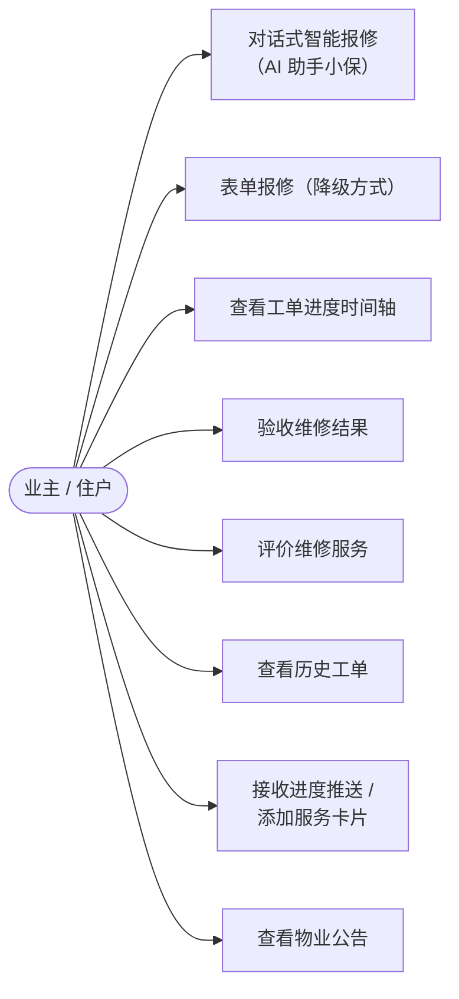
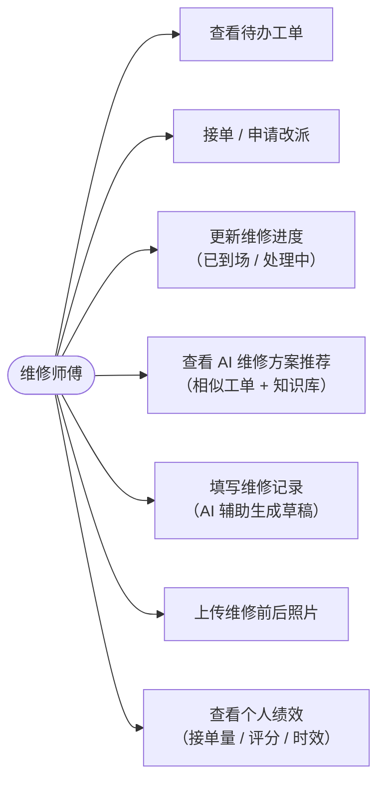
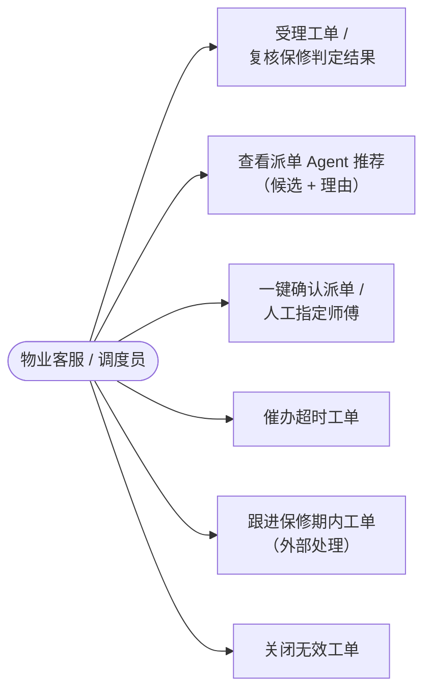
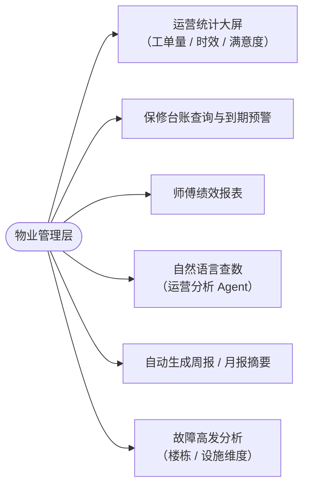
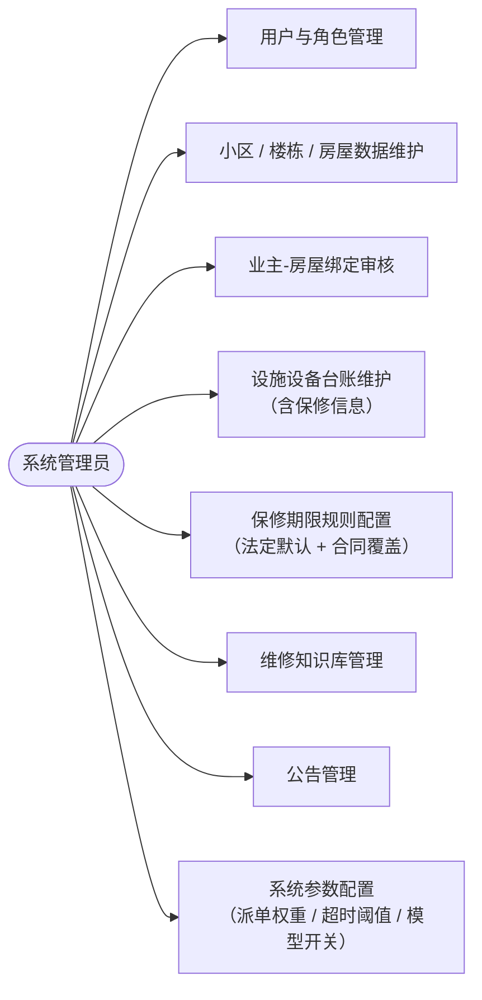

# 02 需求分析

> 前置阅读：[01-项目概述与创新点](./01-项目概述与创新点.md)
> 本文定义系统的角色、用例与功能 / 非功能需求，是后续流程、架构、数据库、接口设计的统一依据。

---

## 1. 角色分析

### 1.1 系统角色

| 角色 | 角色标识 | 使用端 | 核心职责 |
|------|---------|--------|---------|
| 业主 / 住户 | `OWNER` | 鸿蒙端 | 提交报修、追踪进度、验收评价、查看公告 |
| 维修师傅 | `WORKER` | 鸿蒙端 | 接单 / 申请改派、执行维修、上传记录与照片、查看个人绩效 |
| 物业客服（调度员） | `DISPATCHER` | PC 端 | 受理工单、复核保修判定、确认 / 干预派单、催办与关单、跟进保修期内工单 |
| 物业管理层 | `MANAGER` | PC 端 | 查看统计大屏、保修台账与到期预警、师傅绩效、自然语言查数与周报 |
| 系统管理员 | `ADMIN` | PC 端 | 用户与角色管理、小区 / 楼栋 / 房屋数据、设施台账、保修规则、知识库、系统参数 |

### 1.2 外部相关方（非系统登录角色）

| 相关方 | 与系统的关系 |
|--------|-------------|
| 开发商 / 承建商对接人 | 保修期内工单的责任承接方。系统记录其联系方式，工单判定为保修期内时自动通知（短信 / 站内信），由物业客服跟进处理结果并在系统内闭环 |
| 物业公司管理层之外的监管部门 | 使用导出的台账与统计报表（远期扩展，本期不做登录入口） |

### 1.3 角色与端的映射

```
鸿蒙端 App（一个 App，登录后按角色渲染界面）
├── OWNER   → 业主工作台（报修 / 进度 / 评价 / 服务卡片）
└── WORKER  → 师傅工作台（待办 / 维修执行 / 绩效）

PC 端 Web 管理后台
├── DISPATCHER → 工单调度工作台
├── MANAGER    → 运营管理工作台
└── ADMIN      → 系统管理工作台
```

---

## 2. 用例分析

### 2.1 业主 / 住户（鸿蒙端）



**关键用例说明**

- **UC1 对话式智能报修**：业主描述"家里卫生间漏水"，小保追问位置细节、持续时间、是否持续滴水，识别业主上传的照片，检索自助排障知识库（若属可自助解决的小故障则给出建议），最终生成结构化工单预填单（房屋、部位、故障类型、紧急度、照片），业主确认提交。
- **UC4 验收**：师傅完工提交后，业主查看维修前后对比照片，选择"通过"或"不通过（返工 + 原因）"。超过 48 小时未处理视为默认通过（可配置）。

### 2.2 维修师傅（鸿蒙端）



### 2.3 物业客服 / 调度员（PC 端）



### 2.4 物业管理层（PC 端）



### 2.5 系统管理员（PC 端）



---

## 3. 功能需求清单

> 编号规则：`FR-{端}-{序号}`，端缩写 O=业主端、W=师傅端、D=客服端、M=管理层端、A=管理员端、S=服务端公共。
> 优先级：★★★ 核心（比赛必演示）、★★ 重要、★ 一般。

### 3.1 鸿蒙端·业主（FR-O）

| 编号 | 功能 | 需求描述 | 优先级 |
|------|------|---------|--------|
| FR-O-01 | 账号注册登录 | 手机号 + 验证码注册；业主身份由管理员审核绑定房屋后激活 | ★★★ |
| FR-O-02 | 对话式智能报修 | 与 AI 助手「小保」多轮对话报修：自动追问关键信息、识别照片故障类型、检索自助排障建议、生成工单预填单 | ★★★ |
| FR-O-03 | 表单报修 | 传统表单：选择房屋 → 部位 → 故障类型 → 描述 + 照片 + 紧急程度；作为 AI 降级方式常驻入口 | ★★★ |
| FR-O-04 | 工单进度追踪 | 时间轴展示工单全部流转节点（受理 / 派单 / 接单 / 到场 / 完工 / 验收），节点带时间与处理人 | ★★★ |
| FR-O-05 | 验收 | 查看维修前后对比照片与维修记录，通过 / 不通过（填返工原因） | ★★★ |
| FR-O-06 | 评价 | 星级 + 标签（态度好 / 速度快 / 一次修复）+ 文字评价 | ★★★ |
| FR-O-07 | 历史工单 | 按状态 / 时间筛选查询本人全部工单 | ★★ |
| FR-O-08 | 消息推送 | 受理、派单、完工等关键节点 Push 通知 | ★★★ |
| FR-O-09 | 服务卡片 | 工单进度添加为鸿蒙桌面服务卡片，实时刷新 | ★★ |
| FR-O-10 | 公告查看 | 查看停水停电等物业公告 | ★ |

### 3.2 鸿蒙端·师傅（FR-W）

| 编号 | 功能 | 需求描述 | 优先级 |
|------|------|---------|--------|
| FR-W-01 | 师傅登录 | 管理员创建师傅账号并分配技能标签（水电 / 土建防水 / 门窗五金 / 电梯设备 / 暖通空调 / 公共设施） | ★★★ |
| FR-W-02 | 待办工单列表 | 展示已派待接、进行中的工单，含位置、故障类型、紧急度、业主联系方式（脱敏可选） | ★★★ |
| FR-W-03 | 接单 / 拒单 | 接受派单；无法处理时申请改派并填写原因（回流派单池并通知客服） | ★★★ |
| FR-W-04 | 维修进度更新 | 「已到场」「处理中」状态打卡，触发业主端进度刷新 | ★★★ |
| FR-W-05 | AI 维修方案推荐 | 基于工单内容检索历史相似工单与知识库，给出方案建议与所需材料清单 | ★★ |
| FR-W-06 | 维修记录填写 | 故障原因、处理措施、更换材料、工时；支持 AI 依据对话与照片生成草稿，师傅确认修改 | ★★★ |
| FR-W-07 | 照片上传 | 维修前后照片（ watermark 时间水印），完工必填后照片 | ★★★ |
| FR-W-08 | 完工提交 | 提交后工单进入待验收，通知业主 | ★★★ |
| FR-W-09 | 个人绩效 | 接单量、完结量、平均处理时长、业主评分、好评率 | ★★ |

### 3.3 PC 端·物业客服（FR-D）

| 编号 | 功能 | 需求描述 | 优先级 |
|------|------|---------|--------|
| FR-D-01 | 工单池 | 全部工单看板（按状态 / 故障类型 / 小区 / 紧急度筛选），新工单声光提醒 | ★★★ |
| FR-D-02 | 受理与判定复核 | 受理工单；展示保修判定引擎结果与条款依据，客服可人工纠正（留痕） | ★★★ |
| FR-D-03 | 派单确认 | 展示 Agent 推荐的 Top3 候选师傅及评分、画像与推荐理由，一键确认或人工指定 | ★★★ |
| FR-D-04 | 改派处理 | 处理师傅改派申请与超时自动改派结果 | ★★ |
| FR-D-05 | 催办 | 对超时环节一键催办（推送给责任人），查看催办记录 | ★★ |
| FR-D-06 | 保修期外工单跟进 | 保修期内工单记录与开发商 / 承建商的沟通进展，处理完成后确认关单 | ★★ |
| FR-D-07 | 工单关闭 | 无效 / 重复工单关闭并注明原因（通知业主） | ★★ |

### 3.4 PC 端·管理层（FR-M）

| 编号 | 功能 | 需求描述 | 优先级 |
|------|------|---------|--------|
| FR-M-01 | 统计大屏 | 工单量趋势、状态分布、故障类型 Top、平均处理时长、满意度、师傅排行（ECharts） | ★★★ |
| FR-M-02 | 保修台账 | 公共设施设备保修台账：设施、责任单位、保修起始 / 到期日、剩余天数、关联工单 | ★★★ |
| FR-M-03 | 保修到期预警 | 临期（默认 90 天内，可配置）设施清单与预警提醒 | ★★ |
| FR-M-04 | 师傅绩效报表 | 按时间段统计师傅接单量、时效、评分、返工率 | ★★ |
| FR-M-05 | 自然语言查数 | 运营分析 Agent：输入"上月水电类工单平均处理时长"，返回图表 / 表格结果 | ★★ |
| FR-M-06 | 周报 / 月报生成 | Agent 自动汇总工单数据生成图文报告草稿，支持导出 | ★ |
| FR-M-07 | 故障高发分析 | 按楼栋 / 设施维度聚合故障，识别高发点 | ★ |

### 3.5 PC 端·系统管理员（FR-A）

| 编号 | 功能 | 需求描述 | 优先级 |
|------|------|---------|--------|
| FR-A-01 | 用户管理 | 增删改查全部用户、分配角色、重置密码、停用启用 | ★★★ |
| FR-A-02 | 房产数据维护 | 小区 → 楼栋 → 房屋三级数据维护，含竣工日期（保修判定依据） | ★★★ |
| FR-A-03 | 业主绑定审核 | 审核业主注册与房屋绑定申请 | ★★★ |
| FR-A-04 | 设施台账维护 | 电梯、消防、水泵等公共设施信息与保修信息维护 | ★★ |
| FR-A-05 | 保修规则配置 | 维护保修期限规则（法定默认 + 合同覆盖），规则变更留痕 | ★★★ |
| FR-A-06 | 知识库管理 | 自助排障与维修知识条目的增删改查、重新向量化 | ★★ |
| FR-A-07 | 公告管理 | 发布 / 撤回公告，指定范围（小区级） | ★ |
| FR-A-08 | 系统参数 | 派单权重、接单超时阈值、验收超时自动通过时长、AI 功能开关与模型配置 | ★★ |

### 3.6 服务端公共（FR-S）

| 编号 | 功能 | 需求描述 | 优先级 |
|------|------|---------|--------|
| FR-S-01 | 统一认证 | JWT 登录态，多端共用账号体系 | ★★★ |
| FR-S-02 | 保修判定引擎 | 依据保修规则 + 竣工 / 起保日期判定工单责任方，输出依据条款（详见 03 §4） | ★★★ |
| FR-S-03 | 智能派单服务 | 多因子评分 + Agent 决策，支持推荐确认 / 全自动两种模式与超时自动改派（详见 03 §5、05 §4） | ★★★ |
| FR-S-04 | 消息通知中心 | Push（鸿蒙 Push Kit）、站内信、短信三种通道，按事件模板发送 | ★★★ |
| FR-S-05 | 文件服务 | MinIO 对象存储，照片 / 附件上传下载，类型与大小校验 | ★★★ |
| FR-S-06 | 操作留痕 | 关键动作（判定纠正、人工派单、关单）全量操作日志 | ★★ |
| FR-S-07 | AI 降级控制 | 大模型健康检查与自动降级 / 恢复（详见 05 §8） | ★★★ |

---

## 4. 非功能需求

| 编号 | 类别 | 需求描述 |
|------|------|---------|
| NFR-01 | 性能 | 常规接口 P95 响应 < 500ms；对话接口首 token < 3s；支持 500 并发在线用户（演示与初赛规模，架构预留水平扩展） |
| NFR-02 | 安全 | 密码 BCrypt 加密存储；JWT 有效期控制与刷新；RBAC 接口鉴权；手机号等敏感信息脱敏展示；上传文件类型白名单；防提示词注入（Agent 输入输出双重过滤，详见 05 §8） |
| NFR-03 | 可靠性 | **核心链路（表单报修 → 判定 → 规则派单 → 维修 → 验收）不依赖大模型**；大模型故障自动降级并告警；工单数据每日备份 |
| NFR-04 | 可用性 | 界面中文、适老化字号适配（鸿蒙端）；关键操作二次确认；表单必填校验与友好错误提示 |
| NFR-05 | 兼容性 | 鸿蒙端适配 HarmonyOS NEXT（API 12+）手机与平板；PC 端支持 Chrome / Edge 最新两个大版本 |
| NFR-06 | 可维护性 | 模块化单体 + 清晰分层；统一响应体 / 异常 / 日志规范；配置项集中管理 |
| NFR-07 | 可扩展性 | 支持多小区 SaaS 化（数据按小区隔离）；派单算法因子可配置；大模型供应商可切换（OpenAI 兼容协议） |
| NFR-08 | 可审计性 | Agent 决策日志、保修判定结果、人工干预动作全量留痕，可追溯可回放 |

---

## 5. 需求边界说明

**本期不做**（避免范围蔓延，可在答辩中作为"规划"陈述）：

- 维修费用在线支付（期外有偿维修仅线下收费，系统记录金额）；
- 开发商 / 承建商独立登录入口（本期由客服代录跟进结果）；
- IoT 设备直连告警自动生成工单（预留接口）；
- 多物业公司的多租户计费。

---

## 导航

- 上一篇：[01-项目概述与创新点](./01-项目概述与创新点.md)
- 下一篇：[03-业务流程分析](./03-业务流程分析.md) —— 状态机与全流程时序
- 返回：[README](./README.md)
