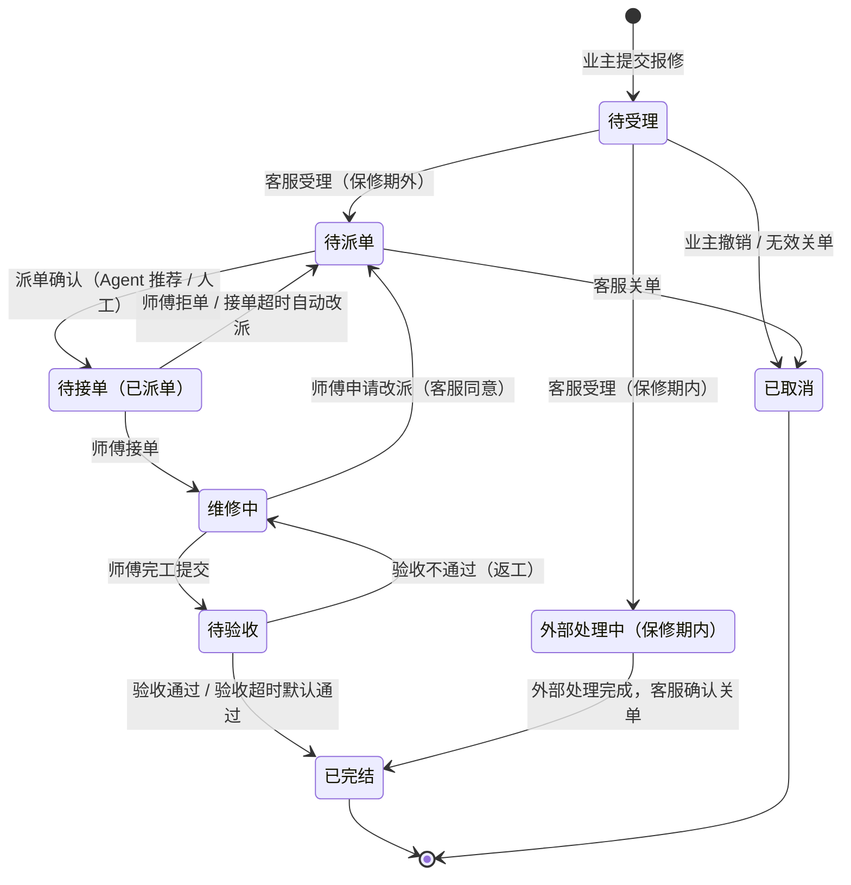
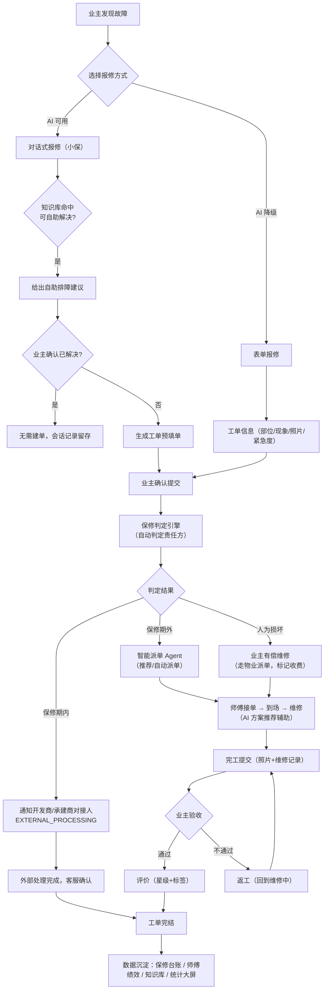
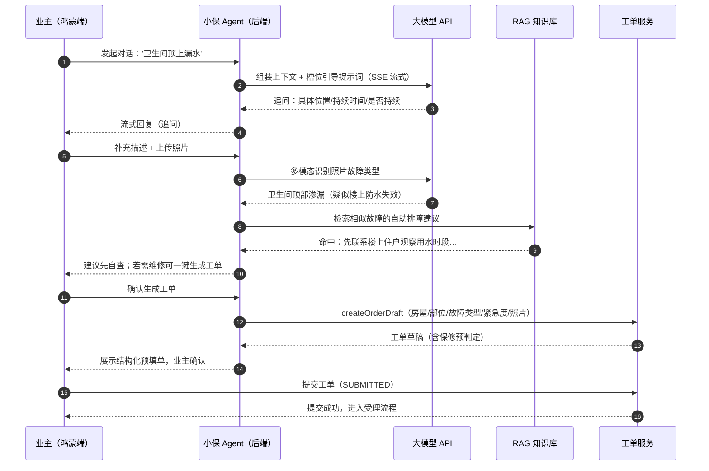
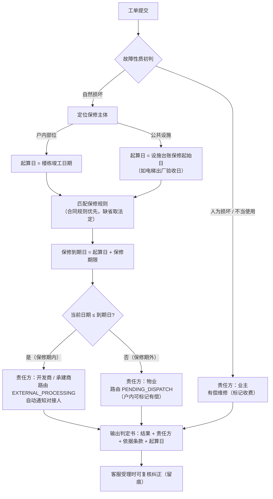
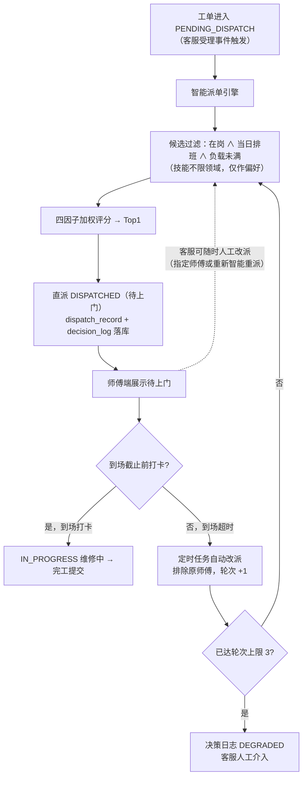
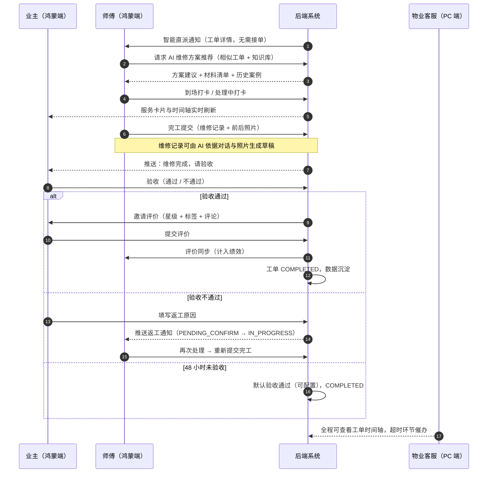
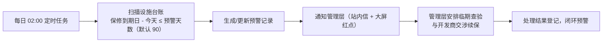

# 03 业务流程分析

> 前置阅读：[02-需求分析](./02-需求分析.md)
> 本文给出全系统统一口径的**工单状态机**与核心业务流程，04~07 号文档均以本文为准。

---

## 1. 工单状态机（全文档统一口径）



**状态说明**

| 状态 | 含义 | 责任人 |
|------|------|--------|
| SUBMITTED 待受理 | 工单已提交，等待客服受理 | 物业客服 |
| PENDING_DISPATCH 待派单 | 已受理（保修期外），等待派单 | 系统 / 物业客服 |
| EXTERNAL_PROCESSING 外部处理中 | 保修期内，已通知开发商 / 承建商对接人 | 物业客服跟进 |
| DISPATCHED 待接单 | 已派给师傅，等待接单 | 维修师傅 |
| IN_PROGRESS 维修中 | 师傅已接单（已到场 / 处理中） | 维修师傅 |
| PENDING_CONFIRM 待验收 | 完工已提交，等待业主验收 | 业主 |
| COMPLETED 已完结 | 验收通过（或外部处理完成） | — |
| CANCELLED 已取消 | 业主撤销、无效工单或客服关单 | — |

---

## 2. 总体业务流程



---

## 3. 前端报修流程：对话式（主）与表单（降级）

### 3.1 对话式报修时序



### 3.2 表单报修（降级方式）

固定表单字段：报修房屋（默认绑定房屋，可切换）→ 报修对象（户内部位 / 公共设施）→ 部位类别（水电 / 土建防水 / 门窗 / 暖通 / 电梯 / 其他）→ 故障描述 → 照片（≤6 张）→ 紧急程度（紧急 / 普通）。提交后进入同一受理与判定流程，与对话式工单无差别。

---

## 4. 保修判定引擎流程

判定依据：《建设工程质量管理条例》第四十条法定最低保修期限 + 物业合同自定义条款（合同优先）。

| 工程部位 | 法定最低保修期限 |
|---------|----------------|
| 地基基础与主体结构 | 设计文件规定的合理使用年限 |
| 屋面防水、有防水要求的卫生间 / 房间 / 外墙面防渗漏 | 5 年 |
| 供热与供冷系统 | 2 个采暖期 / 供冷期 |
| 电气管线、给排水管道、设备安装与装修工程 | 2 年 |
| 保温工程 | 5 年 |



**判定结果数据结构**（后端统一返回，业主端仅展示通俗结论）：

```json
{
  "verdict": "IN_WARRANTY",          // IN_WARRANTY / OUT_OF_WARRANTY / OWNER_RESPONSIBLE
  "responsibleParty": "DEVELOPER",   // DEVELOPER / PROPERTY / OWNER
  "basisRule": "法定·屋面防水工程 5 年（条例第四十条）",
  "warrantyStart": "2023-06-30",
  "warrantyExpire": "2028-06-30",
  "routeTo": "EXTERNAL_PROCESSING"
}
```

---

## 5. 智能派单与自动改派流程

### 5.1 派单算法（详见 [05-AI-Agent功能设计](./05-AI-Agent功能设计.md) §4）

**Step 1 候选过滤**（确定性规则）：在岗（`on_duty`）且当日有排班 且 进行中工单数 < 上限（默认 3）；**技能不限领域**，仅作评分偏好（精确 1.0 / 相关 0.6 / 其他 0.3）。

**Step 2 多因子加权评分**：

```
Score = 0.4 × 技能匹配度 + 0.25 × 负载空闲度 + 0.2 × 位置就近度 + 0.15 × 历史评分
```

| 因子 | 计算方式 | 权重 |
|------|---------|------|
| 技能匹配度 | 精确匹配故障类别 = 1.0；相关类别 = 0.6（如水电↔暖通）；其余 = 0 | 0.40 |
| 负载空闲度 | 1 − 进行中工单数 / 单量上限 | 0.25 |
| 位置就近度 | 师傅常驻小区与工单小区一致 = 1.0，否则按同小区 / 邻近配置衰减 | 0.20 |
| 历史评分 | 近 90 天平均评分 / 5.0（无评分新师傅取默认 0.8） | 0.15 |

**Step 3 Agent 决策**：对 Top3 候选做在岗 / 请假等规则复核，生成自然语言推荐理由；`agent_decision_log` 落库。

### 5.2 派单与改派流程（迭代 2 口径：无接单环节，智能体直派）



---

## 6. 维修执行 → 验收 → 评价闭环



---

## 7. 保修到期预警流程（定时任务）



## 8. 超时催办阈值（默认值，管理员可配置）

| 环节 | 阈值 | 超时动作 |
|------|------|---------|
| 客服受理（普通 / 紧急） | 30 分钟 / 10 分钟 | 提醒客服，大屏标黄 |
| 师傅接单 | 15 分钟 | 自动改派（次优候选顺延） |
| 上门到场（普通 / 紧急） | 接单后 4 小时 / 2 小时 | 催办推送师傅 |
| 完工提交 | 接单后 24 小时 | 催办推送师傅，通知客服 |
| 业主验收 | 48 小时 | 默认验收通过 |
| 外部处理跟进 | 每工单 7 天未更新进展 | 提醒客服跟进开发商 |

---

## 导航

- 上一篇：[02-需求分析](./02-需求分析.md)
- 下一篇：[04-系统架构与技术选型](./04-系统架构与技术选型.md)
- 返回：[README](./README.md)
