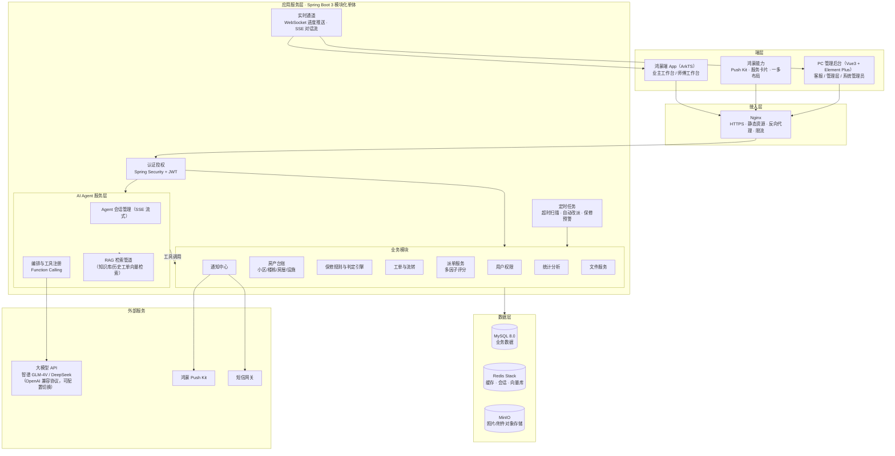
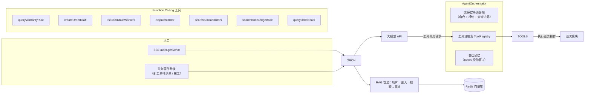
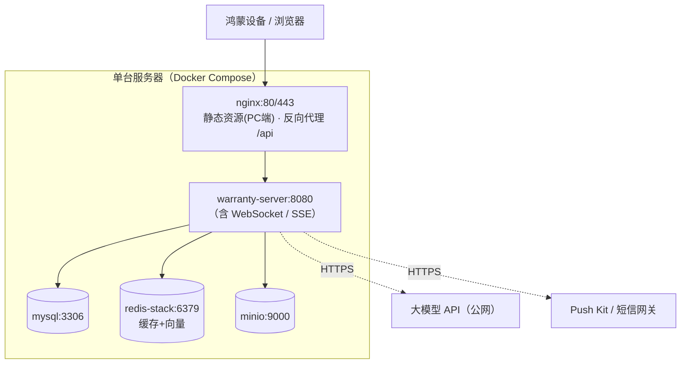

# 04 系统架构与技术选型

> 前置阅读：[03-业务流程分析](./03-业务流程分析.md)
> 本文给出系统总体架构、模块划分、技术选型论证与部署方案。

---

## 1. 总体架构

系统采用「**三端一云 + AI Agent**」的分层架构：多端前端统一接入一个 Spring Boot 后端，后端内部划分业务模块与 AI Agent 服务层，AI 通过**工具调用（Function Calling）操作业务系统**，而不是旁路绕过业务规则。



**架构要点**

1. **单一后端服务多端**：鸿蒙端与 PC 端共用同一套 RESTful API 与账号体系（JWT），降低维护成本。
2. **AI 与业务解耦**：Agent 服务层只通过注册的工具（建单草稿、查师傅、派单等）操作业务模块，业务规则（状态机、权限、判定引擎）始终由业务模块保证，AI 出错不会破坏数据一致性。
3. **实时通道分工**：Agent 对话用 SSE（单向 token 流、HTTP 生态、断线重连简单），工单进度用 WebSocket（双向、多端同步）。

---

## 2. 后端工程结构（模块化单体）

```
warranty-pro-server
├── warranty-common        # 统一响应体 / 异常 / 工具 / 常量（工单状态枚举等唯一出处）
├── warranty-auth          # Spring Security + JWT 认证授权
├── warranty-user          # 用户 / 角色 / 权限
├── warranty-estate        # 小区 / 楼栋 / 房屋 / 设施台账
├── warranty-warranty      # 保修规则配置 + 判定引擎（纯函数，零 AI 依赖）
├── warranty-order         # 工单 / 流转记录 / 验收评价
├── warranty-dispatch      # 派单：候选过滤 + 多因子评分 + Agent 决策接入
├── warranty-agent         # Agent 会话 / 编排 / 工具注册 / RAG 管道 / 降级控制
├── warranty-notify        # 通知中心（Push Kit / 短信 / 站内信，事件模板）
├── warranty-stat          # 统计分析（大屏指标 / 绩效 / 自然语言查数指标域）
├── warranty-file          # MinIO 文件服务
└── warranty-bootstrap     # 启动装配与全局配置
```

模块间依赖单向（common ← 业务模块 ← bootstrap），跨模块调用走接口（Spring Bean 注入），为将来拆分微服务预留边界。

---

## 3. 技术选型清单与论证

| 层次 | 选型 | 版本基线 | 选型理由 |
|------|------|---------|---------|
| 后端框架 | Spring Boot | 3.3+（Java 21） | 生态成熟、团队技能匹配、内嵌容器部署简单 |
| ORM | MyBatis-Plus | 3.5.x | 国内资料丰富、CRUD 效率高、复杂 SQL 可控 |
| 安全 | Spring Security + JWT | 6.x | 标准化 RBAC 与多端令牌方案 |
| 业务数据库 | MySQL | 8.0 | 关系型主存储，事务保障工单流转 |
| 缓存 / 向量 | Redis Stack | 7.x | 缓存 + 验证码 + 会话，RediSearch 兼作 **RAG 向量库**（少部署一个组件）；数据量增长后可平滑演进到 Milvus |
| 对象存储 | MinIO | 最新稳定版 | S3 协议自主可控、Docker 一键部署、可迁移公有云 OSS |
| AI 框架 | Spring AI | 1.0 | Spring 原生集成：ChatClient / Advisor / VectorStore / Function Calling 抽象统一；通过 OpenAI 兼容协议适配智谱 GLM-4V（多模态）、DeepSeek 等，**供应商可配置切换** |
| 实时通信 | WebSocket + SSE | — | 进度推送（WebSocket）与 Agent 流式对话（SSE）分工，见 §1 |
| 定时任务 | Spring Task | — | 超时扫描 / 自动改派 / 保修预警（单机演示规模足够，预留 XXL-JOB 演进） |
| PC 前端 | Vue3 + TypeScript + Vite + Element Plus + Pinia + ECharts | 3.4 / 5.x | 主流管理后台技术栈，组件库完善，大屏可视化成熟 |
| 鸿蒙端 | ArkTS + ArkUI | HarmonyOS NEXT（API 12+） | 原生一多能力、服务卡片、Push Kit；业主 / 师傅共用代码库按角色渲染 |
| 网关 / 部署 | Nginx + Docker Compose | — | 演示环境一键拉起；生产演进见 §5 |

### 关键设计决策问答

**Q1：为什么是模块化单体而不是微服务？**
比赛团队规模小、开发周期短，单体降低部署与联调复杂度、演示更可靠；模块边界（Maven 多模块 + 单向依赖）已按可拆分原则设计，答辩时可说明演进路径（order / dispatch / agent 天然适合先拆）。

**Q2：为什么 AI 用 Spring AI 而不是 LangChain4j 或直接 HTTP 调模型？**
Spring AI 与 Spring Boot 装配一体化（自动配置、观测、重试），ChatClient + VectorStore + Tool 抽象让「换模型、换向量库」只是改配置；直接 HTTP 调用则要把 Function Calling 协议、重试、流式解析全部手写。LangChain4j 作为备选方案，能力相当，选 Spring AI 主要为与主框架一致性。

**Q3：为什么向量库用 Redis Stack 而不是独立的 Milvus？**
知识库与历史工单规模（万级文档）远未到需要专用向量库的量级；复用已有 Redis 可少维护一个有状态组件（Milvus 依赖 etcd + MinIO，部署重）。Spring AI 的 VectorStore 抽象保证后续切换 Milvus 只改配置。

**Q4：保修判定引擎为什么完全不用 AI？**
判定必须 100% 确定性与可解释（法定条款 + 日期比较），它是全系统责任界定的"法律依据"，AI 仅用于其上游（对话抽取故障信息）与下游（向业主解释通俗结论），核心计算保持规则化。

---

## 4. AI Agent 服务层架构（概要）

> 详细设计见 [05-AI-Agent功能设计](./05-AI-Agent功能设计.md)。



设计原则：**工具即权限**——每个工具内部再次做 RBAC 与业务校验，Agent 无法越权；工具入参出参均有 JSON Schema，模型输出经 Schema 校验后才执行。

---

## 5. 部署架构

### 5.1 演示 / 比赛环境（Docker Compose 一键部署）



`docker compose up -d` 拉起全部组件；鸿蒙端 App 通过内网 / 公网 IP + HTTPS 访问统一 API。

### 5.2 生产演进路径

- 应用层水平扩展：warranty-server 多实例 + Nginx 负载均衡（JWT 无状态，天然支持；WebSocket 需引入 Redis Pub/Sub 广播进度消息）；
- 数据层：MySQL 主从 + 定期备份；向量检索切 Milvus 集群；
- 任务调度：Spring Task → XXL-JOB；观测：接入 SkyWalking / Prometheus。

---

## 6. 安全设计

| 层面 | 措施 |
|------|------|
| 认证 | 手机号 + 验证码 / 密码登录；JWT（Access 2h + Refresh 7d），Redis 黑名单实现登出与强制下线 |
| 授权 | RBAC 五角色（OWNER/WORKER/DISPATCHER/MANAGER/ADMIN），接口级注解鉴权；Agent 工具内部二次校验 |
| 数据 | 密码 BCrypt；手机号 / 身份信息脱敏展示；照片 URL 走带签名的临时访问链接 |
| 传输 | 全站 HTTPS |
| 文件 | 上传类型白名单（jpg/png/webp），单文件 ≤ 10MB，重命名为 UUID 防路径穿越 |
| AI 安全 | 提示词注入防护（输入清洗 + 系统提示词隔离）、输出 JSON Schema 校验、敏感数据不出域（工具返回前脱敏）、Agent 决策日志审计 |
| 审计 | 登录、判定纠正、人工派单、关单等关键操作全量留痕（操作人 / 时间 / 前后值） |

---

## 7. 可靠性与降级设计

| AI 能力 | 正常模式 | 降级模式（大模型不可用时） | 恢复 |
|---------|---------|--------------------------|------|
| 对话式报修 | 小保多轮引导 + 照片识别 | 自动切换表单报修入口，App 内提示 | 定时健康检查通过后恢复 |
| 智能派单理由 | 评分 + Agent 复核 + 自然语言理由 | 仅多因子评分排序，Top1 直接推荐（理由显示评分明细） | 同上 |
| 维修方案推荐 | 相似工单 RAG + 总结 | 纯向量相似度检索列表（无总结） | 同上 |
| 运营分析查数 / 周报 | 自然语言 → 指标查询 + 总结 | 标准报表页面 | 同上 |

- **健康检查**：Agent 服务层每 60 秒探测模型 API（1 token 级 ping），连续 3 次失败触发熔断降级，恢复后自动切回；
- **幂等**：派单、自动改派等事件处理带幂等键，避免定时任务重试导致重复派单；
- **备份**：MySQL 每日全量备份 + binlog；MinIO 数据目录定期快照。

---

## 导航

- 上一篇：[03-业务流程分析](./03-业务流程分析.md)
- 下一篇：[05-AI-Agent功能设计](./05-AI-Agent功能设计.md)
- 返回：[README](./README.md)
