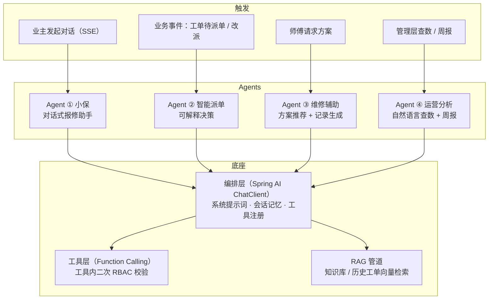
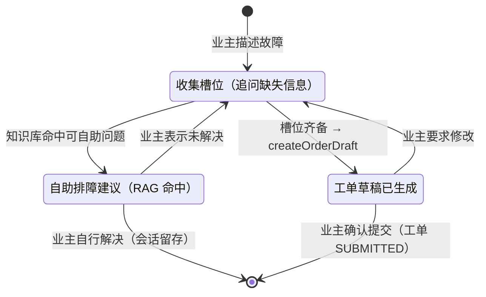
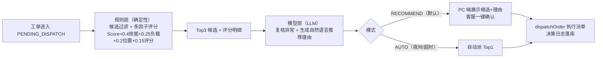
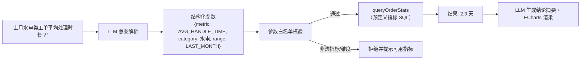

# 05 AI Agent 功能设计

> 前置阅读：[04-系统架构与技术选型](./04-系统架构与技术选型.md)（Agent 服务层架构图）
> 本文是系统的核心创新设计：4 个 Agent 的职责边界、工具调用、提示词策略、RAG 管道与安全降级方案。

---

## 1. Agent 体系总览



**职责边界表**

| Agent | 触发方式 | 服务对象 | 核心工具 | 降级方式 |
|-------|---------|---------|---------|---------|
| ① 小保·报修助手 | 用户发起（SSE 流式） | 业主 | `queryWarrantyRule`、`searchKnowledgeBase`、`createOrderDraft` | 表单报修 |
| ② 智能派单 | 事件触发（工单受理 / 拒单 / 接单超时） | 系统 + 客服 | `listCandidateWorkers`、`getWorkerStats`、`dispatchOrder` | 纯规则评分派单 |
| ③ 维修辅助 | 师傅主动请求 | 维修师傅 | `searchSimilarOrders`、`searchKnowledgeBase`、`draftRepairReport` | 纯相似工单列表 |
| ④ 运营分析 | 管理层发起 | 管理层 | `queryOrderStats`、`queryWorkerStats` | 标准报表页 |

**统一设计原则**

1. **AI 不碰核心规则**：状态机流转、保修判定、权限校验全部由业务模块保证；Agent 只能通过工具发起请求，工具内部二次校验。
2. **一切决策留痕**：每个 Agent 的输入摘要、模型输出、模式（推荐 / 自动）、耗时落入 `agent_decision_log`，可审计可回放。
3. **确定性优先**：能用规则算的不用模型猜（派单评分是规则；模型只做复核与解释）。

---

## 2. 技术底座落地（Spring AI）

| 能力 | Spring AI 组件 | 本项目用法 |
|------|---------------|-----------|
| 模型对话 | `ChatClient` | 统一入口，通过 OpenAI 兼容协议配置智谱 GLM-4V / DeepSeek，`spring.ai.openai.base-url` 一键切换 |
| 工具调用 | `@Tool` / ToolCallback | §1 各工具注册；模型返回的调用参数经 JSON Schema 校验后执行 |
| 流式输出 | `stream()` + SseEmitter | 小保对话逐 token 推送 |
| RAG | `VectorStore`（Redis Stack）+ `EmbeddingModel` | 知识库 / 历史工单向量检索 |
| 会话记忆 | ChatMemory（Redis 存储） | 滑动窗口保留最近 10 轮，超窗摘要压缩 |

---

## 3. Agent ① 「小保」对话式报修助手（鸿蒙端·业主）

### 3.1 对话状态设计



### 3.2 槽位定义（结构化工单的来源）

| 槽位 | 必填 | 说明 | 获取方式 |
|------|------|------|---------|
| `house` | ✔ | 报修房屋 | 默认取业主绑定房屋，多套时追问 |
| `object_type` | ✔ | 户内部位 / 公共设施 | 由描述与照片推断，不确定时追问 |
| `category` | ✔ | 故障类别（水电 / 土建防水 / 门窗五金 / 暖通空调 / 电梯设备 / 公共设施 / 其他） | 描述 + 照片多模态识别 |
| `location_detail` | ✔ | 具体位置（如"卫生间顶部"） | 追问 |
| `phenomenon` | ✔ | 故障现象与持续时间 | 追问 |
| `urgency` | — | 紧急 / 普通（默认普通） | 缺省即可 |
| `photos` | — | ≤ 6 张 | 业主上传，多模态识别辅助分类 |

### 3.3 工具定义示例

```json
{
  "name": "createOrderDraft",
  "description": "槽位收集齐备后调用：根据报修信息生成结构化工单草稿（含保修预判定），返回给业主确认。不得在槽位缺失时调用。",
  "parameters": {
    "type": "object",
    "properties": {
      "houseId":     { "type": "integer" },
      "objectType":  { "enum": ["INDOOR", "PUBLIC_FACILITY"] },
      "category":    { "type": "string" },
      "locationDetail": { "type": "string" },
      "phenomenon":  { "type": "string" },
      "urgency":     { "enum": ["URGENT", "NORMAL"] },
      "photoIds":    { "type": "array", "items": { "type": "integer" } }
    },
    "required": ["houseId", "objectType", "category", "locationDetail", "phenomenon"]
  }
}
```

`createOrderDraft` 内部会调用保修判定引擎做**预判定**（判定书随草稿展示），正式判定在客服受理时复核。

### 3.4 系统提示词要点（结构示意）

```
你是物业报修助手"小保"，帮业主完成报修。
【任务】1. 用最多 1~2 个问题/轮追问缺失槽位；2. 对可自助解决的小故障，
先检索知识库给建议；3. 槽位齐备后调用 createOrderDraft 并引导业主确认。
【安全边界】不承诺维修时间与费用；不透露师傅个人信息；不讨论与报修无关话题；
检测到人身/水电安全紧急情况，提示拨打应急电话并标记紧急工单。
【风格】口语化、共情、单轮不超过 3 句话。
```

### 3.5 SSE 事件协议

| event | data | 说明 |
|-------|------|------|
| `message` | `{ "delta": "…" }` | 流式回复片段 |
| `kb_advice` | `{ "items": [...] }` | 自助排障建议卡片 |
| `draft` | `{ "orderId": null, "draft": {...}, "verdict": {...} }` | 工单草稿 + 保修预判定 |
| `done` | `{}` | 本轮结束 |
| `degraded` | `{ "fallback": "FORM" }` | AI 不可用，引导表单报修 |

---

## 4. Agent ② 智能派单（可解释决策）

### 4.1 规则与模型的分工



- **规则层**输出机器可验证的评分明细（每个候选的四个因子得分），是排序依据；
- **模型层**只做两件事：① 异常复核（如"当前评分最高的师傅近期有 3 单差评，建议次选"）；② 把评分明细翻译成客服可读的推荐理由；
- 即使模型层完全失效，规则层输出依然可用（降级即"无理由版"）。

### 4.2 决策输出示例（`agent_decision_log.output`）

```json
{
  "orderId": 1024,
  "candidates": [
    { "workerId": 12, "name": "张师傅", "score": 0.86,
      "factors": { "skill": 1.0, "load": 0.67, "location": 1.0, "rating": 0.96 } },
    { "workerId": 8,  "name": "李师傅", "score": 0.79,
      "factors": { "skill": 0.6, "load": 1.0, "location": 1.0, "rating": 0.88 } }
  ],
  "recommendation": 12,
  "reason": "张师傅为水电类专精（技能满分），当前仅 1 单在处理，常驻本小区，近 90 天评分 4.8/5，综合得分最高。",
  "mode": "RECOMMEND",
  "confidence": 0.92
}
```

### 4.3 两种模式与自动改派

| 模式 | 触发 | 行为 |
|------|------|------|
| RECOMMEND 推荐（默认） | 工作时间客服在岗 | 推荐结果进入 PC 端待办，客服一键确认或人工改派（留痕） |
| AUTO 自动 | 夜间 / 节假日 / 客服超时 15 分钟未处理 | 直接派 Top1 并 Push 通知；师傅 15 分钟未接单自动顺延次优（最多 3 轮，见 03 §5.2） |

---

## 5. Agent ③ 维修辅助（鸿蒙端·师傅）

**场景 A · 维修方案推荐**（师傅点开工单"AI 助手"）：

1. `searchSimilarOrders`：以工单描述 + 故障类别为查询，向量检索历史完结工单 Top5（相似度 + 同类别加权）；
2. `searchKnowledgeBase`：检索维修知识条目；
3. 模型综合生成：**处理步骤建议 + 所需材料清单 + 风险提示**（如"涉电作业先断闸"），并标注参考案例来源（工单号脱敏）。

**场景 B · 维修记录草稿**（完工提交时）：

师傅语音 / 文字口述 + 维修照片 → 模型按 `draftRepairReport` 的 Schema 生成结构化草稿（故障原因 / 处理措施 / 更换材料 / 工时），师傅核对修改后提交。预期将平均填单时间从 5 分钟压缩到 1 分钟内。

---

## 6. Agent ④ 运营分析（PC 端·管理层）

**NL2Query 采用「受限指标域」而非直接生成 SQL**（杜绝注入与越权）：



- **指标域白名单**：工单量、平均处理时长、完结率、满意度、故障类型分布、师傅排行、保修到期分布；维度：时间段、小区、故障类别、状态；
- **周报 / 月报**：按模板拉取全量指标 → 模型生成图文摘要（同比 / 环比、异常点提示）→ 管理层确认后导出。

---

## 7. RAG 知识库设计

| 项 | 设计 |
|----|------|
| 语料来源 | ① 自助排障知识（管理员维护，FR-A-06）；② 维修知识文档（水电 / 防水 / 门窗等类别）；③ 历史完结工单维修记录（结构化转文本，T+1 入库） |
| 切片策略 | 按知识条目自然分块（500 字 / 50 字重叠）；维修记录以单工单为单元 |
| 嵌入模型 | 国产嵌入 API（智谱 embedding-3 / bge-m3，随主模型供应商配置） |
| 向量存储 | Redis Stack（Spring AI RedisVectorStore），按 `doc_type`（KB / ORDER）+ `category` 元数据过滤 |
| 检索策略 | 混合检索：向量 Top5 + 类别过滤；演示阶段不引入重排模型（预留 bge-reranker 接口） |
| 更新机制 | 知识编辑后异步重新嵌入；无效文档软删除 |

---

## 8. 安全与降级

### 8.1 AI 安全

| 风险 | 对策 |
|------|------|
| 提示词注入 | 用户输入以隔离块包裹并做模式检测（"忽略以上指令"等）；系统提示词不出现在任何返回中 |
| 越权工具调用 | 工具内二次 RBAC + 业务校验（如 `dispatchOrder` 校验工单状态与操作者角色） |
| 幻觉（编造师傅 / 数据） | 关键输出仅来自工具返回值，模型禁止生成工具未提供的 ID / 数字；Schema 校验失败即拒答重试（最多 2 次） |
| 敏感数据外泄 | 工具返回给模型前脱敏（手机号 / 住址截断）；照片 URL 使用临时签名链接 |
| 成本失控 | 单会话轮数上限 20、token 预算告警；会话记忆滑动窗口压缩 |

### 8.2 降级矩阵

见 [04-系统架构与技术选型 §7](./04-系统架构与技术选型.md)：健康检查（60s 探测、连续 3 次失败熔断）→ 自动降级 → 恢复自动切回；**核心链路（表单报修 → 判定 → 规则派单 → 维修 → 验收）全程无 AI 依赖**。

---

## 导航

- 上一篇：[04-系统架构与技术选型](./04-系统架构与技术选型.md)
- 下一篇：[06-数据库设计](./06-数据库设计.md)
- 返回：[README](./README.md)
