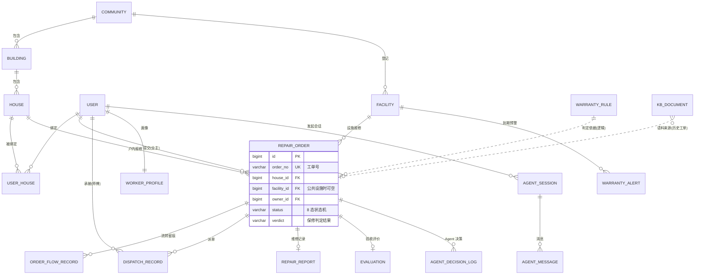

# 06 数据库设计

> 前置阅读：[03-业务流程分析](./03-业务流程分析.md)（状态机）、[05-AI-Agent功能设计](./05-AI-Agent功能设计.md)
> 数据库：MySQL 8.0，InnoDB，`utf8mb4`。表前缀按模块分组；所有表含通用字段 `created_at`、`updated_at`，业务主表含逻辑删除 `deleted`，下文字段表中省略。

---

## 1. 设计约定

- 主键统一 `id BIGINT AUTO_INCREMENT`；
- 枚举一律 `VARCHAR` 存代码值（如工单状态 `SUBMITTED`），代码唯一出处为后端 `warranty-common` 中的枚举类，禁止魔法值散落；
- 工单表**冗余保修判定结果快照**（`verdict_*` 字段）：规则后续修改不影响历史工单的判定留痕；
- 向量数据不存 MySQL（存 Redis Stack，见 [05 §7](./05-AI-Agent功能设计.md)），MySQL 中仅存 `kb_document` 元数据与 `vector_id`；
- 不建物理外键：表间为逻辑外键，参照完整性由应用层保证，便于分库分表演进；
- 建表脚本：[warranty-pro-server/sql/01_schema.sql](../warranty-pro-server/sql/01_schema.sql)（DDL）+ [02_seed.sql](../warranty-pro-server/sql/02_seed.sql)（角色 / 法定保修规则 / 参数缺省值），与本文档同步维护，**以 SQL 为准**；
- 日志类表（流转 / 通知 / 操作 / Agent 消息与决策）仅保留 `created_at`，其余表含 `created_at` / `updated_at`。

---

## 2. E-R 总览

> 角色权限（`sys_user` / `sys_role` / `sys_user_role`）、公告、附件、通知、操作日志为支撑表，关系简单，不进入 E-R 主图。

---

## 3. 表结构定义

### 3.1 用户与权限组

**sys_user 用户表**

| 字段 | 类型 | 说明 |
|------|------|------|
| id | BIGINT PK | |
| username | VARCHAR(50) UK | 登录账号（全角色统一） |
| phone | VARCHAR(20) NULL UK | 手机号（联系方式，非登录账号） |
| password_hash | VARCHAR(100) | BCrypt |
| real_name | VARCHAR(50) | |
| avatar | VARCHAR(255) | |
| status | TINYINT | 1 启用 / 0 停用 |
| last_login_at | DATETIME | |

**sys_role 角色表**：`id`、`code` UK（OWNER / WORKER / DISPATCHER / MANAGER / ADMIN）、`name`。
**sys_user_role 用户角色表**：`user_id`、`role_id`，UK(user_id, role_id)。业主与师傅可为同一人（家人是师傅的场景），其余角色互斥由业务层约束。

### 3.2 房产与设施组

**community 小区表**：`id`、`name`、`address`、`developer_name`（开发商，保修对接方）、`contact`。

**building 楼栋表**

| 字段 | 类型 | 说明 |
|------|------|------|
| id / community_id | BIGINT | |
| name | VARCHAR(50) | 如"3 栋" |
| **completion_date** | DATE | **竣工日期：户内保修判定起算日** |

**house 房屋表**：`id`、`building_id`、`unit`、`room_no`、`area`，UK(building_id, unit, room_no)。

**user_house 业主-房屋绑定表**

| 字段 | 类型 | 说明 |
|------|------|------|
| id / user_id / house_id | BIGINT | |
| relation | VARCHAR(20) | OWNER 业主 / TENANT 租户 / FAMILY 家属 |
| status | VARCHAR(20) | PENDING 待审 / APPROVED / REJECTED |
| audited_by | BIGINT | 审核管理员 |

**facility 设施设备台账表**

| 字段 | 类型 | 说明 |
|------|------|------|
| id / community_id | BIGINT | |
| name | VARCHAR(100) | 如"1 号楼电梯" |
| type | VARCHAR(30) | ELEVATOR / FIRE / PUMP / FACADE / HVAC / OTHER |
| location | VARCHAR(100) | |
| supplier_name / contact_name / contact_phone | VARCHAR | 承建（供应）方与对接人 |
| install_date | DATE | 安装验收日 |
| **warranty_start / warranty_end** | DATE | 保修起止（起算日，到期日可由规则推算后落库存档） |

**warranty_rule 保修期限规则表**

| 字段 | 类型 | 说明 |
|------|------|------|
| id | BIGINT PK | |
| scope | VARCHAR(20) | LEGAL 法定默认 / CONTRACT 合同覆盖 |
| part_category | VARCHAR(30) | 部位类别（防水 / 供热供冷 / 电气管线 / 主体结构 / 保温 …） |
| duration_value | INT | 期限数值 |
| duration_unit | VARCHAR(20) | YEAR / HEATING_SEASON（采暖期特殊计算） |
| community_id | BIGINT NULL | NULL=全局生效（合同规则可按小区覆盖） |
| source | VARCHAR(200) | 依据（"条例第四十条" / 合同名） |
| priority | INT | 合同 > 法定，同 scope 内数值大者优先 |

**warranty_alert 保修到期预警表**：`id`、`alert_target`（FACILITY 设施 / BUILDING 楼栋，G6）、`target_id`、`warranty_end`、`days_left`、`status`（PENDING / PROCESSED）、`handled_by`、`handled_at`、`remark`。由每日定时任务生成（03 §7），UK(alert_target, target_id, warranty_end) 保证扫描幂等去重。

### 3.3 工单组（核心）

**repair_order 报修工单表**

| 字段 | 类型 | 说明 |
|------|------|------|
| id | BIGINT PK | |
| order_no | VARCHAR(32) UK | 单号：`WO` + yyyyMMdd + 4 位序列 |
| community_id | BIGINT | 冗余，加速筛选 |
| house_id | BIGINT NULL | 户内报修时必填 |
| facility_id | BIGINT NULL | 公共设施报修时必填 |
| owner_id | BIGINT | 提交业主 |
| object_type | VARCHAR(20) | INDOOR / PUBLIC_FACILITY |
| category | VARCHAR(30) | 故障类别（水电 / 土建防水 / 门窗五金 / 暖通空调 / 电梯设备 / 公共设施 / 其他） |
| location_detail | VARCHAR(100) | 具体位置 |
| phenomenon | VARCHAR(500) | 故障现象描述 |
| urgency | VARCHAR(10) | URGENT / NORMAL |
| source | VARCHAR(20) | AI_CHAT 对话式 / FORM 表单 |
| source_session_id | BIGINT NULL | AI 报修来源会话（agent_session.id，追溯对话） |
| **status** | VARCHAR(20) | 状态机 8 态（03 §1） |
| verdict | VARCHAR(30) | 判定快照：IN_WARRANTY / OUT_OF_WARRANTY / OWNER_RESPONSIBLE |
| responsible_party | VARCHAR(20) | 判定快照：DEVELOPER / PROPERTY / OWNER |
| verdict_basis | VARCHAR(300) | 判定快照：依据条款 |
| warranty_start / warranty_expire | DATE | 判定快照：起算 / 到期日 |
| verdict_adjusted_by | BIGINT NULL | 客服纠正人（留痕） |
| paid_status | VARCHAR(20) | NOT_REQUIRED 无需收费 / UNPAID 待收费 / PAID 已收费 |
| fee_amount | DECIMAL(10,2) NULL | 有偿维修金额（线下收费，系统登记） |
| current_worker_id | BIGINT NULL | 当前师傅 |
| dispatch_mode | VARCHAR(20) | RECOMMEND / AUTO / MANUAL |
| accept_deadline | DATETIME | 接单截止（超时自动改派） |
| submitted_at / accepted_at / dispatched_at / started_at / completed_at / confirmed_at | DATETIME | 各环节时间（时效统计依据） |
| cancel_reason | VARCHAR(200) | 取消 / 关单原因 |

**order_flow_record 工单流转记录表**：`id`、`order_id`、`from_status`、`to_status`、`operator_id`、`operator_role`、`action`（SUBMIT / ACCEPT / DISPATCH / REASSIGN / START / COMPLETE / CONFIRM / REJECT_CONFIRM / CANCEL…）、`remark`。业主端时间轴与催办依据均取此表。

**dispatch_record 派单记录表**

| 字段 | 类型 | 说明 |
|------|------|------|
| id / order_id / worker_id | BIGINT | 一次派单一行（含改派历史） |
| mode | VARCHAR(20) | AUTO / RECOMMEND / MANUAL |
| score | DECIMAL(4,3) | 综合得分 |
| factors | JSON | 四因子得分明细 |
| reason | VARCHAR(500) | Agent 推荐理由 |
| status | VARCHAR(20) | DISPATCHED / ACCEPTED / REJECTED（待接期拒单）/ PENDING_REASSIGN（维修中申请改派待审）/ TIMEOUT_REASSIGNED |
| round_no | INT | 第几轮派单（自动改派轮次，上限 3） |
| dispatched_by | BIGINT NULL | 人工派单时的操作客服 |
| reject_reason | VARCHAR(200) NULL | 拒单 / 改派申请原因 |

**worker_profile 师傅画像表**（与 `sys_user` 一对一）

| 字段 | 类型 | 说明 |
|------|------|------|
| user_id | BIGINT PK | |
| skill_tags | JSON | ["水电","土建防水","门窗五金","暖通空调","电梯设备","公共设施"] 子集 |
| community_id | BIGINT | 常驻小区（位置就近因子） |
| max_concurrent | INT | 并发单量上限，默认 3 |
| on_duty | TINYINT | 在岗开关（请假关闭） |
| rating_avg | DECIMAL(3,2) | 全期平均评分（评价写入时增量维护；近 90 天口径由统计查询聚合） |
| rating_count / order_total / order_completed | INT | 统计快照 |

**repair_report 维修记录表**：`id`、`order_id` UK、`worker_id`、`fault_cause`、`measures`、`materials` JSON、`work_hours` DECIMAL(4,1)、`ai_assisted` TINYINT（是否 AI 辅助生成）。

**evaluation 评价表**：`id`、`order_id` UK、`owner_id`、`worker_id`、`stars` TINYINT(1-5)、`tags` JSON（态度好 / 速度快 / 一次修复…）、`comment` VARCHAR(500)。

### 3.4 Agent 组

**agent_session Agent 会话表**：`id`、`user_id`、`agent_type`（XIAOBAO / REPAIR_ASSIST / ANALYSIS；派单 Agent 为事件触发无用户会话）、`biz_ref_id` BIGINT NULL（关联工单等）、`status`（ACTIVE / CLOSED / DEGRADED）。

**agent_message 会话消息表**：`id`、`session_id`、`role`（USER / ASSISTANT / TOOL）、`content` TEXT、`tool_name` VARCHAR(50) NULL、`token_count` INT。

**agent_decision_log Agent 决策日志表**

| 字段 | 类型 | 说明 |
|------|------|------|
| id | BIGINT PK | |
| agent_type | VARCHAR(30) | XIAOBAO / DISPATCH / REPAIR_ASSIST / ANALYSIS |
| order_id | BIGINT NULL | 关联工单（派单 Agent） |
| mode | VARCHAR(20) | RECOMMEND / AUTO / — |
| input_summary | VARCHAR(500) | 输入摘要（脱敏后） |
| output | JSON | 决策输出（05 §4.2 示例） |
| model | VARCHAR(50) | 使用的模型标识 |
| latency_ms | INT | 耗时 |
| status | VARCHAR(20) | OK / SCHEMA_FAIL / DEGRADED |

**kb_document 知识库文档表**：`id`、`doc_type`（KB 知识 / ORDER 历史工单语料）、`category`、`title`、`content` TEXT、`source_order_id` BIGINT NULL、`vector_id` VARCHAR(64)（Redis 向量主键）、`status`（ACTIVE / EMBEDDING / DELETED）。

### 3.5 支撑组（简表）

| 表 | 关键字段 | 说明 |
|----|---------|------|
| notice 公告 | community_id NULL（全局）、title、content、type、status | FR-A-07 |
| attachment 附件 | biz_type、biz_id、file_key、content_type、size、uploader_id | 通用附件（工单照片、维修照片等），MinIO 存储，idx(biz_type, biz_id) |
| sys_config 系统参数 | config_key UK、config_value、remark、updated_by | 运行时可变参数（派单权重 / 超时阈值 / AI 开关，FR-A-08；yml 为缺省值） |
| notify_record 通知记录 | user_id、channel（PUSH/SMS/INBOX）、event、biz_id、status | 通知中心发送留痕 |
| operation_log 操作日志 | user_id、module、action、target、before_value、after_value | 判定纠正 / 人工派单 / 关单等留痕（FR-S-06） |

---

## 4. 关键索引与典型查询

| 表 | 索引 | 支撑的典型查询 |
|----|------|---------------|
| repair_order | UK(order_no)；idx(owner_id, created_at)；idx(current_worker_id, status)；idx(status, community_id, created_at)；idx(accepted_at) | 业主历史工单、师傅待办看板、客服工单池、时效统计 |
| order_flow_record | idx(order_id, created_at) | 时间轴渲染 |
| dispatch_record | idx(order_id, round_no)；idx(worker_id, status) | 改派历史、师傅接单统计 |
| facility | idx(community_id, type)；idx(warranty_end) | 台账筛选、到期预警扫描 |
| warranty_rule | idx(part_category, community_id) | 判定引擎规则命中 |
| agent_message | idx(session_id, created_at) | 会话上下文加载 |
| kb_document | idx(doc_type, category, status) | RAG 元数据过滤（向量检索在 Redis） |
| attachment | idx(biz_type, biz_id) | 工单照片等多态关联查询 |
| warranty_alert | UK(alert_target, target_id, warranty_end) | 每日预警扫描幂等去重 |

---

## 5. 数据量估算与扩展

- 单小区约 3,000 户、月均工单 600 单；单项目 10 小区三年约 22 万工单、流转记录约 110 万行 —— 单表规模远低于 MySQL 压力线，**不做分库分表**；
- 预留扩展：工单表按年归档策略（`created_at` 冷热分离）；多物业公司 SaaS 化时增加 `tenant_id` 全表穿透（NFR-07）；
- 向量库容量：知识条目 + 三年历史工单语料约 10 万级向量，Redis Stack 单实例可承载；超出后按 [04 §3](./04-系统架构与技术选型.md) 演进 Milvus。

---

## 导航

- 上一篇：[05-AI-Agent功能设计](./05-AI-Agent功能设计.md)
- 下一篇：[07-接口设计概要](./07-接口设计概要.md)
- 返回：[README](./README.md)
